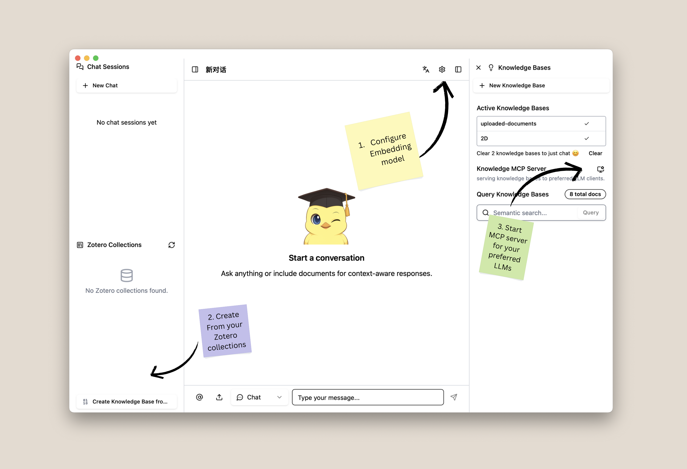
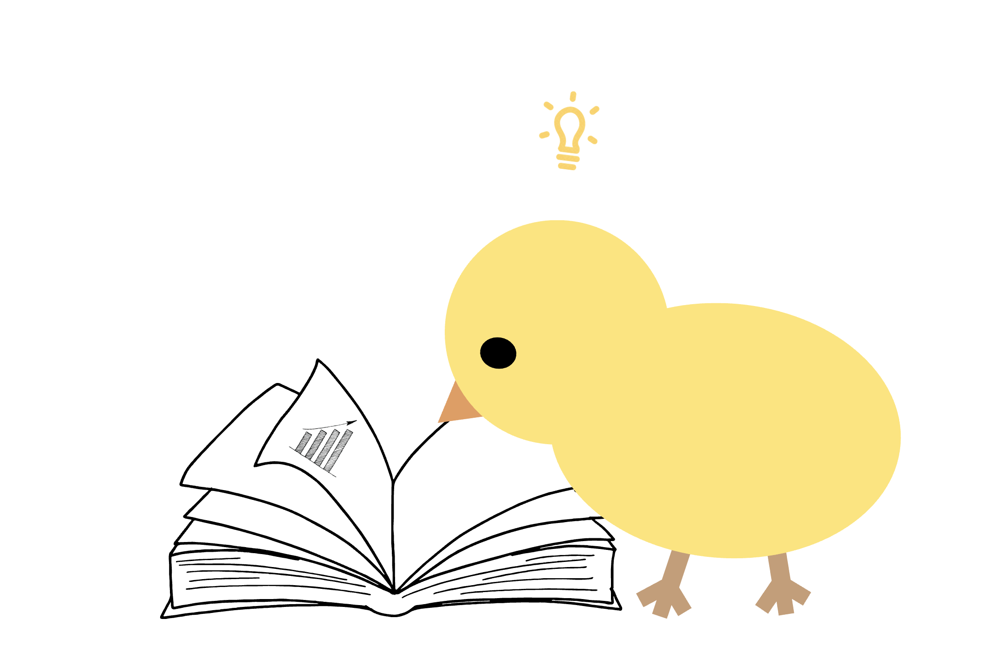

# ChiKen

ChiKen is your private, AI-powered research assistant that transforms your Zotero library into an interactive knowledge base. 

## ✨ Features

ChiKen connects your Zotero library to LLM clients like Claude Desktop through **RAG** and **MCP**. Just make a few clicks, your AI clients are ready to search over your documents.

ChiKen chat interface offers three agents to interact with your research: **Chat** for conversational Q&A with your documents, **Search** for searching papers online, and **Deep Research** for comprehensive multi-source investigations that combine your personal library with web search to generate detailed research reports.

## 💫 Quick Start

Download and install ChiKen from [Releases](https://github.com/yuanjua/chiken/releases) for your platform. PDF and plain text work out of the box; other formats require [Pandoc](https://pandoc.org/) 2+.

We recommend [Ollama](https://ollama.com/) for local LLMs—easy setup for chat and embeddings. Works well with `ollama/gemma3:27b`. For now this is the only recommended and tested model. You can then expose your knowledge bases to advanced LLM clients like Claude Desktop through the built-in MCP server.

All data stays local. API keys are stored in your OS keychain:❓You may see prompts asking for keyring access; knowledge bases live on your disk.

For more detailed instructions, see:
- [Getting Started Guide](./docs/GETTING_STARTED.md)
- [Claude MCP Setup (with demo)](./docs/mcp-claude-desktop-setup.md)
- [Built-in Agents: Chat, Search, Deep Research](./docs/built-in-agents.md)

## 🗺️ What's Next

ChiKen continues to evolve with enhanced document parsing (both lightweight and powerful options for literature), expanded MCP tools for deeper knowledge interaction, and architectural improvements including a planned shift to PyTauri for better performance.

## 🌱 Contributing

We’re excited to welcome contributions!  
A dedicated section with contribution guidelines and instructions is **coming soon**.  
If you have feature requests, bug reports, or ideas, feel free to open an issue or discussion in the meantime.

<!-- contributing: 
communitiy discussions/ feature requests, UI UX suggestions, introducing to your non-coder friend and send feedbacks. -->

## 💬 The Name

In the world of research, **Zotero** helps us *to see* and collect knowledge. The name comes from the Albanian word *zotëroj*, meaning "to master." But how do we turn that collection into true understanding?

This is the question that inspired **ChiKen (知見)**. The name comes from *jñāna-darśana* (ज्ञानदर्शन), a Buddhist term for "knowledge and insight." It represents the flash of understanding that comes from deep engagement with information.

ChiKen is designed to complete the journey Zotero begins: the mastery of information (Zotero) and the spark of insight (ChiKen). We want to help you not just collect knowledge, but to connect with it, question it, and ultimately, to see it in a new light.

## License

The code is licensed under the [MIT License](LICENSE).
The logo is licensed under [CC BY 4.0](./LICENSE-LOGO).
