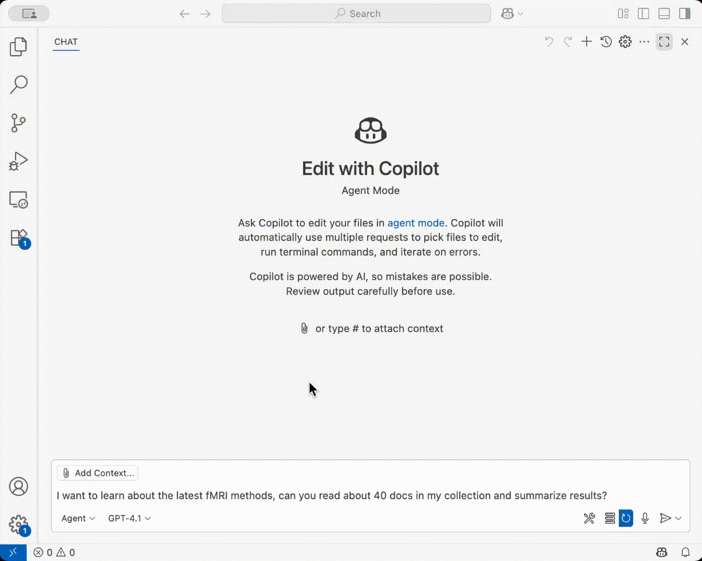
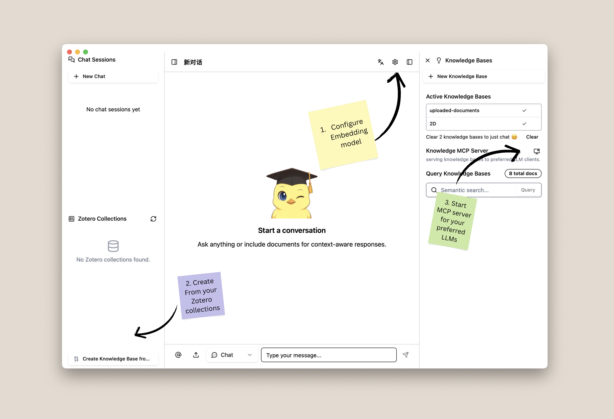
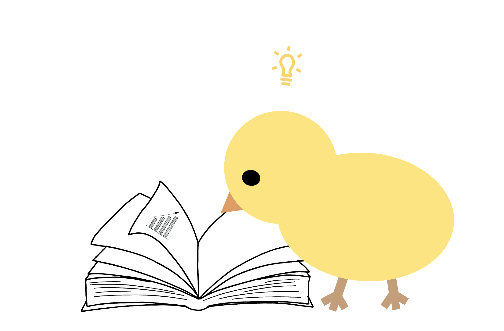

# ChiKen

**ChiKen (知見)** is your private, AI-powered research assistant. It seamlessly connects your Zotero library with local and cloud-based Large Language Models (LLMs), transforming your personal research collection into an interactive knowledge base.

## ✨ Features

*   **AI-Powered Research Assistant**: Integrate your Zotero library with local (Ollama) or remote LLMs. Perform advanced search, review, and summarization of your research documents right on your desktop.

*   **Flexible LLM Backend**: Powered by LiteLLM, ChiKen supports a wide range of LLMs, including local instances via Ollama and major cloud providers.

*   **Privacy by Design**: All processing can be performed locally, so your research data never leaves your machine. No need to log in or rely on external servers.

*   **Effortless Knowledge Base Construction**: A simple click to turn your Zotero collections into a vector knowledge base. Brew a coffee ☕️, and your knowledge base would be ready before the first sip.

*   **Simple RAG Search**: Use Retrieval-Augmented Generation to query across your knowledge bases. Find the most relevant document chunks to feed LLMs based on semantic meaning, not just keywords.

*   **One-Click MCP Server for Your Knowledge**: An internal server that lets any preferred LLM access your deep knowledge bases. No code for you to set up! 

*   **🚀 No-Code Setup**: Designed to work out-of-the-box. Just install, point it to your LLM endpoint, and start exploring your research in a whole new way.

 

## 🚀 Quick Start

**Installation**: Simply install choosing the installer for your platform in [Releases](https://github.com/yuanjua/chiken/releases).
(Currently only MacOS and Windows builds are tested.)

**Dependency**: PDF and plain text files are supported. Other file types (.docx, etc.) requires [pandoc](https://pandoc.org/) to be installed in your system.

We recommend [Ollama](https://ollama.com/) for simple chat and embedding—it’s easy to install and use. You can then expose the knowledge bases to any other Advanced LLM (e.g. Claude Desktop) through the built-in MCP server.

For more detailed instructions, check out the [Getting Started Guide](GETTING_STARTED.md).

## 🗺️ What's Next

*   **More Agents**: Introducing dedicated agents for in-depth Search, Review, and Summarization tasks.
*   **Smarter Document Parsing**: Integrate both lightweight and powerful options designed for literature processing.
*   **Multi-Modal Understanding**: Take advantage of the latest advancements in local multi-modal LLMs to handle images, PDFs, and more.
*   ⁉️**More Tests**: Adding comprehensive tests.

## 🤝 Contributing

We’re excited to welcome contributions!  
A dedicated section with contribution guidelines and instructions is **coming soon**.  
If you have feature requests, bug reports, or ideas, feel free to open an issue or discussion in the meantime.

<!-- contributing: 
communitiy discussions/ feature requests, UI UX suggestions, introducing to your non-coder friend and send feedbacks. -->

## 💬 The Name

In the world of research, **Zotero** helps us *to see* and collect knowledge. The name comes from the Albanian word *zotëroj*, meaning "to master." But how do we turn that collection into true understanding?

This is the question that inspired **ChiKen (知見)**. The name comes from *jñāna-darśana* (ज्ञानदर्शन), a Buddhist term for "knowledge and insight." It represents the flash of understanding that comes from deep engagement with information.

ChiKen is designed to complete the journey Zotero begins: the mastery of information (Zotero) and the spark of insight (ChiKen). We want to help you not just collect knowledge, but to connect with it, question it, and ultimately, to see it in a new light.

## License

The code is licensed under the [MIT License](LICENSE).

The ChiKen logo is licensed under [CC BY-NC-ND 4.0](http://creativecommons.org/licenses/by-nc-nd/4.0/).

## Disclaimer

ChiKen is an independent project and is not affiliated with or endorsed by Zotero or the Corporation for Digital Scholarship. Zotero is a registered trademark of the Corporation for Digital Scholarship.
