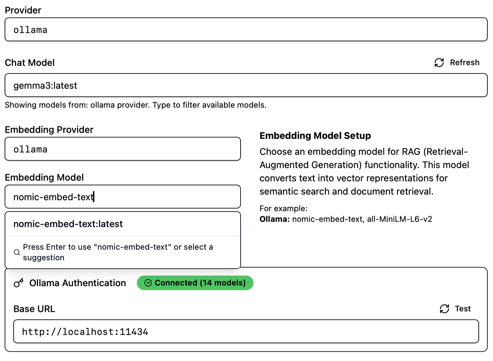
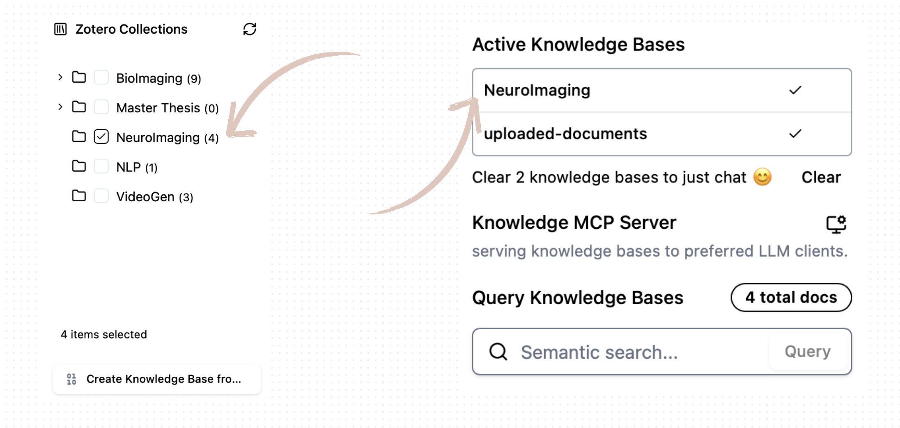
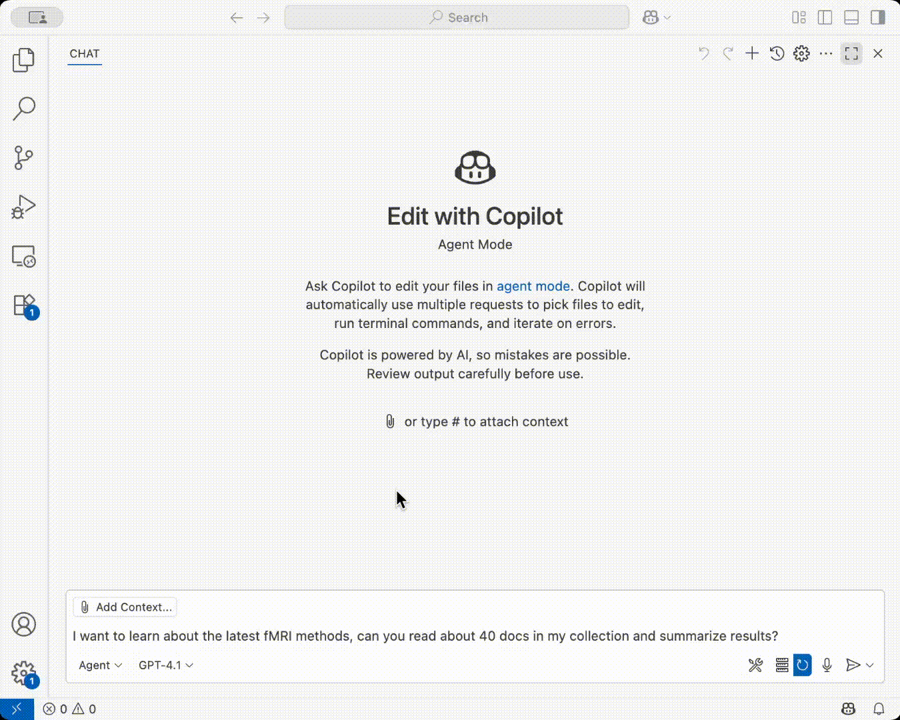

## Getting Started

Welcome to the project! Follow these steps to get started:

### 1. Configure Embedding (and Chat Model if you want to chat here)

[Ollama](https://ollama.com) is the default provider and the only recommended one for now, since we develop and test with it. You can change the provider in the settings.

By entering model names, you'll be prompted to select a model from the provider. 

*not tested yet*:

- For custom OpenAI-format api, select "OpenAI" as the provider and enter your Custom Endpoint in the settings.

### 2. Create Knowledge Bases
**Note:** To use ChiKen with your local Zotero library, you must enable the Zotero Web API:
   - Open Zotero and go to:
     - `Edit → Preferences → Advanced → General (tab)`
   - Check the box:
     - `☑️ Allow other applications on this computer to access data via the Zotero web API`

When Zotero is running on your computer, ChiKen can access your Zotero collections and items locally.

Simply select the collections you want to include in your Knowledge Base. Then click "Create Knowledge Base from Collections" to start the process. You will then see it appears in the Knowledge Base list! See the next step for how to use it.

You can create a Knowledge Base from existing Zotero collections.

### 3. Start MCP Server

If you have subscribed to Advanced LLMs like Claude Desktop, you can start the MCP server to expose your knowledge bases to these models. Please refer to [Claude MCP Setup (with demo)](./mcp-claude-desktop-setup.md).

Now you can leave ChiKen running in the background, and use your favorite LLM client to connect to the MCP server. This example uses VS Code Copilot to call our built-in MCP tools.

The local Chat agent is not optimized for calling tools yet. It is fixed to call once `search_documents` each turn if any knowledge base is active. This is because local models are not good at tool calling, and we don't want you to call paid api in here yet (not tested nor optimized for token usage).

### 4. Chat with Local LLMs

There are some advanced models that support **long context windows**, e.g. gemma3, qwen3, which is important for literature understanding. In the setting page, set larger context size as large as your computer can handle.

### 5. Stay tuned

More agents are planned to be added soon, for example, (web) literature review and deep research agents. 

Happy Researching!

