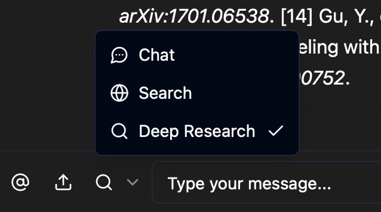
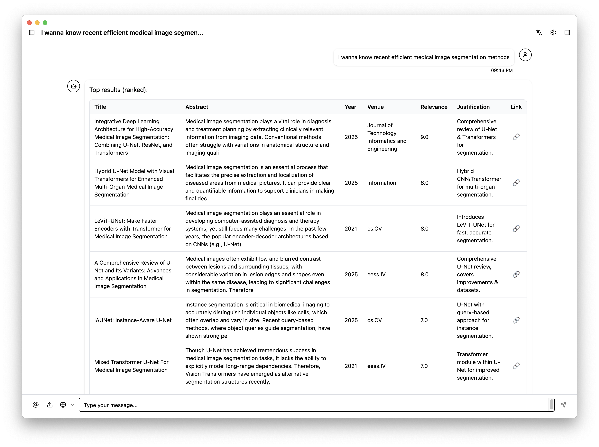
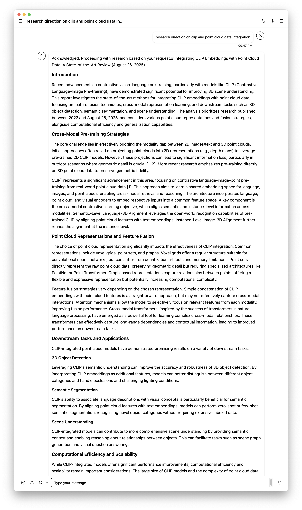

# Using ChiKen's Built-in Agents

### 🗨️ Chat
Just like any other chat! It simply performs one semantic search over your active knowledge bases, then answer your questions. 
**Best for**: Conversational Q&A, quick queries, and interactive discussions

### 🔍 Search Agent  
Based on your query, it search over 5 academic search engines (Open Alex, Semantic Scholar, arXiv, PubMed, and CrossRef) and list formatted results.
**Best for**: Academic research, finding specific papers, and literature reviews

### 🔬 Deep Research Agent
Powered by Langchain's [Open Deep Research](https://github.com/langchain-ai/open_deep_research), this agent performs multiple searches over above mentioned search sites and your active knowledge bases, and finally generates a report.
**Best for**: Comprehensive research reports, multi-topic analysis, and thorough investigations

