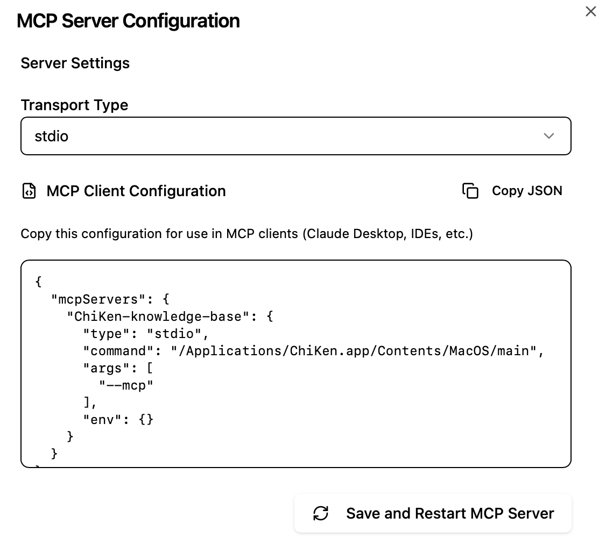
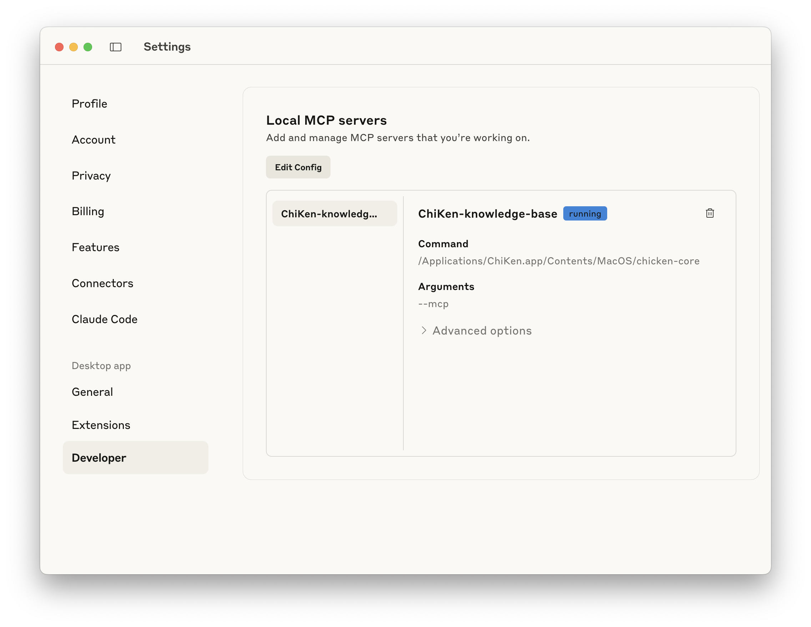

# Setting up MCP for Claude Desktop

Only need to paste the json to Claude Desktop config file.


### Step by Step Guide

1. **Open ChiKen Settings**
   - Launch ChiKen
   - Open MCP Configuration on the right sidebar
   - Click Copy JSON



2. **Go to Claude Desktop**
   - Settings
   - Developer
   - Edit Config



3. **Edit Config**
   - If the file is empty, paste the JSON config
   - Otherwise, add the following to the existing config:

   ```json
   {
    "mcpServers": {
        // Add this part
        "ChiKen-knowledge-base": {
            "type": "stdio",
            "command": "/Applications/ChiKen.app/Contents/MacOS/chicken-core",
            "args": [
                "--mcp"
            ],
            "env": {}
            }
        // END
        }
    }
   ```

   - Save and close

4. **Restart Claude**

Then you are ready to go!

### Demo

Fun fact: hit the free-tier limit after 2 messages — perfect timing for a short demo! 🤗

https://github.com/user-attachments/assets/7a20f4da-a76b-4e3b-8e10-43b7927d67b4
